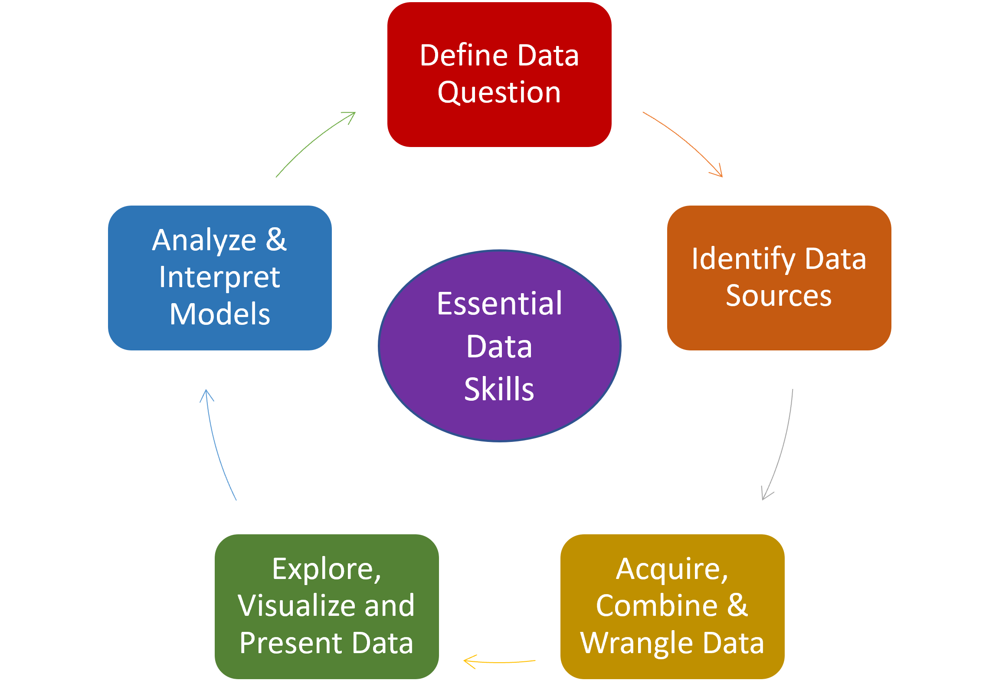
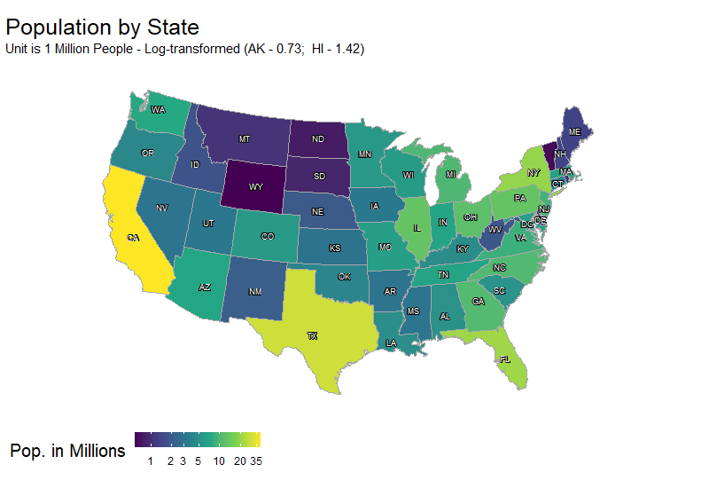

```{r setup, include=FALSE}
options(htmltools.dir.version = FALSE)
knitr::opts_chunk$set(
  fig.retina = 2,
  warning = FALSE,
  message = FALSE,
  htmltools.preserve.raw = FALSE, # needed for windows
  scipen=100,
  getSymbols.warning4.0 = FALSE
)


# install helper package that loads and installs other packages, if needed
if (!require("pacman")) install.packages("pacman", repos = "http://lib.stat.cmu.edu/R/CRAN/")

# install and load required packages
pacman::p_load(pacman, tidyverse, fontawesome, xaringanExtra)

```


```{r xaringan-themer, include=FALSE, warning=FALSE}

library(xaringanthemer)

palette <- c(
  SU_Orange1        = "#F76900",
  SU_Orange2        = "#FF8E00",
  SU_Red_Orange     = "#FF431B",
  SU_Blue1          = "#000E54",
  SU_Blue2          = "#203299",
  SU_Light_Blue     = "#2B72D7",
  SU_White          = "#FFFFFF",
  SU_Light_Gray     = "#ADB3B8",
  SU_Medium_Gray    = "#707780",
  SU_Black          = "#000000", 
  
  steel_blue        = "#4682B4",
  corn_flower_blue  = "#6495ED",
  deep_sky_blue     = "#00BFFF",
  dark_magenta      = "#8B008B",
  medium_orchid     = "#BA55D3",
  lime_green        = "#32CD32",
  light_sea_green   = "#20B2AA",
  chartreuse        = "#7FFF00",
  orange_red        = "#FF4500"
  
)


style_duo(
  
  title_slide_text_color = "#F76900",       # SU_Orange1
  title_slide_background_color = "#000E54", # SU_Blue1
  primary_color = "#203299",                # SU_Blue2
  secondary_color = "#FF8E00",              # SU_Orange2
  inverse_header_color = "#FFFFFF",         # SU_White
  link_color = "#FF4500",                   # orange_red
  code_inline_color = "#FF431B",            # SU_Red_Orange
  text_bold_color = "#F76900",              # SU_Orange1

  header_font_google = google_font("Open Sans"),
  text_font_google = google_font("Open Sans"),
  code_font_google = google_font("Source Code Pro"),
  colors = palette
)

```


```{r xaringan-panelset, echo=FALSE}

xaringanExtra::use_panelset()

```


```{r xaringan-tile-view, echo=FALSE}
xaringanExtra::use_tile_view()

```

```{r xaringan-fit-screen, echo=FALSE}
xaringanExtra::use_fit_screen()

```

```{r xaringan-tachyons, echo=FALSE}
xaringanExtra::use_tachyons()

```

```{r xaringan-animate-css, echo=FALSE}
xaringanExtra::use_animate_css()

```

```{r xaringan-animate-all, echo=FALSE}
xaringanExtra::use_animate_all("slide_up")

```


background-image: url("docs_files/images/whitman_faded.png")
background-size: cover

class: center, middle

## "BUA 455 - Data Management for Business"

### "Learning Innovation Grant Presentation" 

<br>

<br>

#### Penelope Pooler Eisenbies

#### May 10, 2022

---

### Data Management for Business 

.pull-left[
  
  - Course developed for today's **data-driven** world.

- Data is a now a **public-facing** aspect of business and management.

- Students learn how to acquire, combine, 'wrangle' and curate data 

- All assignments, tests, and final project are done in **R and Rstudio**

- Course is divided into **Four Main Parts**


]

.pull-right[



]

---


background-image: url("docs_files/images/tidyverse.png")
background-position: right
background-size: contain

### Part 1

.pull-left[

**Project Skills, Data Wrangling**

  - R coding environment, R projects, RStudio
  
    - File management and documentation
  
  - Data skills:
     - Selecting variables and formatting variables
     - filtering data
     - grouping and summarizing data
     - reshaping data for plots or tables
     - Visualizing and presenting data
    
  - Assignments 1 - 3 reinforce these skills
- ***Course Project introduced and groups determined after Part 1***

]


---

### **Part 2:**  

.pull-left[

**Importing and Combining Data from Different Sources**

  - Data formats
  - Joining datasets in different ways
  - Managing and cleaning text string data
  - Documenting and crediting data sources
  - Expanding on skills from Part 1
  
- Assignments 4 and 5 - Part 1 (Dashboard Assignment)

  - Require more advanced skills and take more time


***Data Sources and Project Ideas Introduced***
  
  - Groups submit a draft and final project proposal.

]

.pull-right[


]


  
---

```{r echo=FALSE}

style_panelset_tabs(active_foreground = "#FF8E00", 
                    foreground = "#FFFFFF",
                    tabs_border_bottom = "#FF8E00",
                    hover_foreground = "#F76900",
                    hover_border_color = "#F76900")

```


.panelset[

.panel[.panel-name[ **Part 3** ]

  - Add to Introductory Dashboard Assignment (HW 5 - Part 1)
  
    - [HW 5 - Part 2](https://rpubs.com/PeneLope_PE/900345) expands on prior assignment.

  - Students **transition from individual to group work**
  
  - **Geographic data** management
  
  - More with text, and troubleshooting data issues
  
  - Student Project Questions
  
  - Curating data in different formats, written documents, html files, slides
  
  - **Time permitting: additional 'Literate Programming' skills**
  
     - Using RStudio to create reports or slides (like this set)
     
     - Introduction to github and version control

]

.panel[.panel-name[**Example Map Data**]

class: center



]

]

     
  
---

### Part 4

**Group Project**

  - **Students Groups (5 - 6 Students) :**
     - Develop a proposal with 3 or more questions
     - Identify multiple data sources to address questions
     - Combine and curate data to develop a multi-panel dashboard


  - **Dashboard must include both:**
     - Interactive and static visualizations with explanatory text
     - Linked text citations to data sources
     
  - **Accompanying the dashboard are two written memos**

     - Memo 1: To supervisor who would have to present dashboard
     - Memo 2: to colleague on how to update dashboard


**Students manage, curate, and present data in a collaborative setting to a achieve an objective.**

- [Example Student Group Dashboard 1 (Fall 2021)](https://rpubs.com/PeneLope_PE/878347)

- [Example Student Group Dashboard 2 (Spring 2022)](https://rpubs.com/wducott/dashboard)

---

### Successes

.pull-left[

- **Dashboard Project** works well for this course.

  - Students learn to apply skills and manage, present, and maintain a project.
  
- Order of course material is now more refined.
  
- Currently turning HTML lecture notes into slide decks like this
  
- BUA 455 selected to test ILTA shared competencies this Spring.
  
- **Graduate TA's are essential** to grading coding assignments and help students
  
- **Feedback has been very positive**

  - Gratifying to see students become more confident in these skills.

]

.pull-right[


[Adirondack Regional Tourism Council](https://visitadirondacks.com/)

]
  
---

### Challenges

.pull-left[

- **1st Iteration:** Developed with short notice for Spring 2021 (Hybrid)

- **R and Rstudio are changing VERY rapidly**

  - 'Open Source' means more work to keep software up to date
  
- **Wide variability in student comfort level with coding** 

  - Akin to learning new languages (S, Markdown)

  - Requires practice and patience
  
- Class size is growing quickly

- **Assessment of data management skills is challenging**

]

.pull-right[


[Adirondack Regional Tourism Council](https://visitadirondacks.com/)

]

---
  
### Effective Assessment Challenges

.pull-left[

- Intermediary assessment is key for the success of the course

  - Each project group should include a wide range of skills

- Testing data management skills in a timed in-class setting is unrealistic

- Take-home tests invite academic dishonesty (too much temptation)

]
  
.pull-right[


[LoveLearningIdeas.com](http://www.lovelearningideas.com/)
]

---

### Solution for Assessment

.pull-left[

- **Two 70 minute in-class tests**
  
  - Test is taken in R/RStudio using provided R project and template 
  
  - 6 or 7 specific 2-3 step data management tasks with questions to answer
  
  - Template is accompanied by Blackboard questions which include R code
  
  - Blackboard allows for multiple versions of same questions
  
  - **Grade is based on both submitted R code and answers to Blackboard questions.**

]

.pull-right[


[LoveLearningIdeas.com](http://www.lovelearningideas.com/)

]


  
  
---

### What's Next

.pull-left[

- Short-term:

  - A little more sleep

  - Creating a R code and video demo repository for data management tasks

  - Continuing to refine the material and assignments
  
- Longer-term(?):

  - Data visualization course that picks up where this one ends

]

.pull.right[


]

  
---

background-image: url("docs_files/images/whitman_faded.png")
background-size: cover

class: center middle

## Thank you Whitman Teaching Committee

<br>

<br>

### Questions?


  

  
  
  
  


